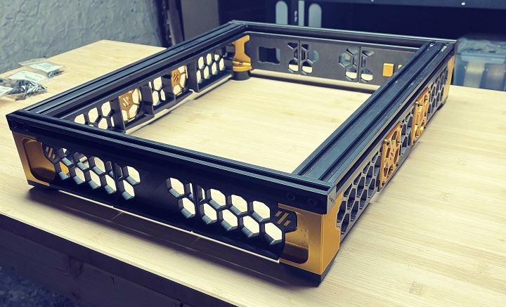

# CR-10-conversion-to-SwitchWire

You will find here all the files needed to upgrade your Creality CR-10/CR-10S to a Voron Switchwire. This is an on-going project, far from being finished so be patient.  
 
There is 2 folder inside the Skirt, one containing all non modified files (original Trident Skirt) and another one containing the files I modified in Fusion 360 to fit the CR-10 frame.
 
 
I also created on my website a blog post about this project but it's in French. The only part that could be interesting for you is the Fusion 360 view ;)
 
https://lamaisondumaker.be/conversion-cr-10s-en-voron-switchwire-ou-presque/ 

 
 
# About the skirt
 
The skirt is a combination of the Trident 250 and the Trident 350 original skirt. To fit the frame of the CR-10 I had to create some custom parts. 
 
For the front side and the back side, I modified only the middle piece to make it smaller by removing a few cm from the middle so the honeycomb remains aligned with the left and right parts.
 
For the sides of the frame I create new parts, except for the middle part that must be the same as original to fit the 6020 fans. I choose also to mount them backwards so the honeycomb stays aligned with the honeycomb from the center part.
 
I'm using the same rubber feet as the Trident. You can find them easily on Internet. I took mine on AliExpress for $7 ^^
 

 

PascalP
